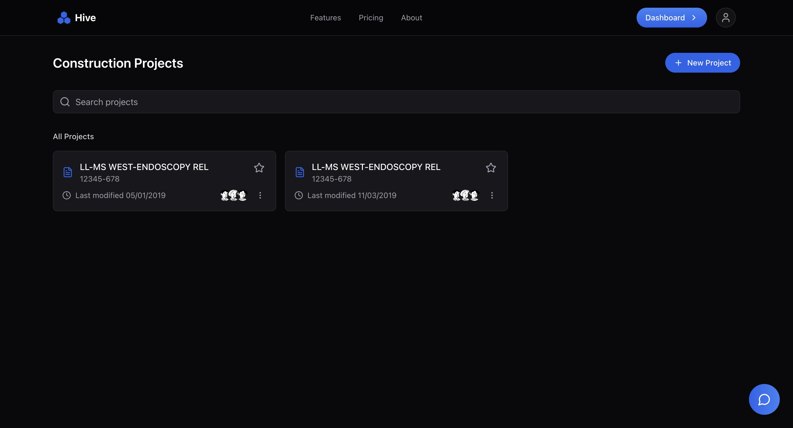

<div align="center">
  <h1>🐝 Hive</h1>
  <p><strong>Construction Reporting Redefined</strong></p>

  <p>
    <a href="#features">Features</a> •
    <a href="#getting-started">Getting Started</a>
  </p>

  
</div>

## Overview

Hive revolutionizes construction reporting by transforming time-consuming documentation into a streamlined, efficient process. Built for construction teams, Hive helps you create professional reports in minutes with an intuitive drag-and-drop interface and smart automation features.

## Features

- ✨ **Hivemind AI** - Your AI assistant for construction reporting
- 🎯 **Drag & Drop Editor** - Effortlessly reorganize report sections
- 📑 **PDF Export** - Generate professional reports with one click
- ⚙️ **Smart Section Controls** - Show/hide report sections instantly

## Project Structure

```sh
hive/
├── api/ # Flask API for Hivemind Chatbot
├── src/ # NextJS frontend
├── .env.local.example # Environment variables
```

## Prerequisites

- [Node.js](https://nodejs.org)
- [Bun](https://bun.sh)
- [Python](https://www.python.org)
- [uv](https://docs.astral.sh/uv)

> [!TIP]
> Use [mise](https://mise.jdx.dev) to automatically install and manage the prerequisites in a single command 🚀
>
> ```sh
> mise install
> ```

## Getting Started

1. Install node dependencies:

   ```sh
   bun install
   ```

2. Install python dependencies:

   ```sh
   uv sync
   ```

3. Add your own values to the `.env.local` file:

   ```sh
   cp .env.local.example .env.local
   ```

4. Run the python API server:

   ```sh
   python -m api.app
   ```

5. Run the nextjs development server (in a different terminal):

   ```sh
   bun dev
   ```

6. Open [http://localhost:3000](http://localhost:3000) in your browser
